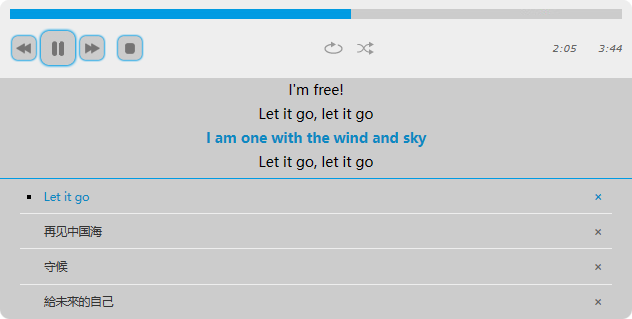

YuanPlayer
==========

[](https://www.npmjs.com/package/yuanplayer-core)
[](https://github.com/Yuan-Projects/YuanPlayer/blob/master/LICENSE.md)
[](https://www.npmjs.com/package/yuanplayer-core)

YuanPlayer is a customizable audio player.



## Features:

### Modules support

YuanPlayer supports various JavaScript modules: AMD, CommonJS, UMD and ESM.

### Lyric and playlist

The lyric and playlist features are built in its core.

### Theme Support

You can choose from open source themes for YuanPlayer, or create your own unique one.

### API Support

Access YuanPlayer functions, change the track, pause and play, skip to previous or next, add new ones, etc. Let it work in harmony with your own application.

### Programmable Events

Register your event listener methods for well designed events. YuanPlayer will do the rest by executing your method when the event occurs.

You can visit the [Developer Guide](https://github.com/Yuan-Projects/YuanPlayer/wiki/Developer-Guide) doc for more information.

## Usage

### NPM

```
npm i yuanplayer-core
npm i yuanplayer-theme-bluemonday
```

```html
<div id="playerContainer1"></div>
```

JavaScript:

```javascript
// If you are using ESM
import YuanPlayer from "yuanplayer-core";
import YuanPlayerThemeBlueMonday from "yuanplayer-theme-bluemonday";

// Or if you are using CommonJS
//const YuanPlayer = require("yuanplayer-core");
//const YuanPlayerThemeBlueMonday = require("yuanplayer-theme-bluemonday");

const BMPlayer = YuanPlayer.use(YuanPlayerThemeBlueMonday);
const bmplayer = new BMPlayer({
  media: {
    title: 'Let it go',
    artist: 'Idina Menzel',
    poster: 'https://y.qq.com/music/photo_new/T002R300x300M000000nmCPL1H8bES_1.jpg?max_age=2592000',
    src: 'https://yuan-projects.github.io/YuanPlayer/demo/media/letitgo.m4a',
    lyric: "[00:00.51]Let It Go - Idina Menzel"+"\n    [00:14.08]The snow glows white on the mountain tonight"+"\n    [00:17.19]Not a footprint to be seen"+"\n    [00:20.86]A kingdom of isolation,"+"\n    [00:22.87]"+"\n    [00:24.30]and it looks like I'm the Queen"+"\n    [00:28.55]The wind is howling like this swirling storm inside"+"\n    [00:35.58]Couldn't keep it in; Heaven knows I've tried"+"\n    [00:42.59]Don't let them in, don't let them see"+"\n    [00:45.91]Be the good girl you always have to be"+"\n    [00:49.40]Conceal, don't feel, don't let them know"+"\n    [00:55.76]Well now they know"+"\n    [00:59.14]Let it go, let it go"+"\n    [01:02.61]Can't hold it back anymore"+"\n    [01:06.17]Let it go, let it go"+"\n    [01:09.39]Turn away and slam the door"+"\n    [01:13.18]I don't care what they're going to say"+"\n    [01:19.82]Let the storm rage on"+"\n    [01:24.21]The cold never bothered me anyway"+"\n    [01:28.38]"+"\n    [01:31.69]It's funny how some distance"+"\n    [01:34.31]Makes everything seem small"+"\n    [01:37.75]And the fears that once controlled me"+"\n    [01:41.18]Can't get to me at all"+"\n    [01:45.66]It's time to see what I can do"+"\n    [01:49.20]To test the limits and break through"+"\n    [01:52.80]No right, no wrong, no rules for me,"+"\n    [01:56.94]I'm free!"+"\n    [02:00.40]Let it go, let it go"+"\n    [02:03.87]I am one with the wind and sky"+"\n    [02:07.21]Let it go, let it go"+"\n    [02:10.75]You'll never see me cry"+"\n    [02:14.49]Here I stand"+"\n    [02:18.22]And here I'll stay"+"\n    [02:21.62]Let the storm rage on"+"\n    [02:33.36]My power flurries through the air into the ground"+"\n    [02:39.79]My soul is spiraling in frozen fractals all around"+"\n    [02:46.80]And one thought crystallizes like an icy blast"+"\n    [02:53.73]I'm never going back, the past is in the past"+"\n    [03:01.78]Let it go, let it go"+"\n    [03:05.31]And I ll rise like the break of dawn"+"\n    [03:08.60]Let it go, let it go"+"\n    [03:12.19]That perfect girl is gone"+"\n    [03:16.25]Here I stand"+"\n    [03:18.87]In the light of day"+"\n    [03:24.85]Let the storm rage on"+"\n    [03:30.09]The cold never bothered me anyway!"+"\n    [03:35.09]"
  },
  container: document.querySelector('#playerContainer1')
});
```

### Via script tag:

Add the following script on your HTML:

```html
<script src='https://cdn.jsdelivr.net/npm/yuanplayer-core@latest/lib/umd/YuanPlayer.min.js'></script>
<script src='https://cdn.jsdelivr.net/npm/yuanplayer-theme-bluemonday@latest/lib/umd/YuanPlayerThemeBlueMonday.min.js'></script>
```

Now, create the player:

```html
<div id="playerContainer1"></div>
<script>
const BMPlayer = YuanPlayer.use(YuanPlayerThemeBlueMonday);
const bmplayer = new BMPlayer({
  media: {
    title: 'Let it go',
    artist: 'Idina Menzel',
    poster: 'https://y.qq.com/music/photo_new/T002R300x300M000000nmCPL1H8bES_1.jpg?max_age=2592000',
    src: 'https://yuan-projects.github.io/YuanPlayer/demo/media/letitgo.m4a',
    lyric: "[00:00.51]Let It Go - Idina Menzel"+"\n    [00:14.08]The snow glows white on the mountain tonight"+"\n    [00:17.19]Not a footprint to be seen"+"\n    [00:20.86]A kingdom of isolation,"+"\n    [00:22.87]"+"\n    [00:24.30]and it looks like I'm the Queen"+"\n    [00:28.55]The wind is howling like this swirling storm inside"+"\n    [00:35.58]Couldn't keep it in; Heaven knows I've tried"+"\n    [00:42.59]Don't let them in, don't let them see"+"\n    [00:45.91]Be the good girl you always have to be"+"\n    [00:49.40]Conceal, don't feel, don't let them know"+"\n    [00:55.76]Well now they know"+"\n    [00:59.14]Let it go, let it go"+"\n    [01:02.61]Can't hold it back anymore"+"\n    [01:06.17]Let it go, let it go"+"\n    [01:09.39]Turn away and slam the door"+"\n    [01:13.18]I don't care what they're going to say"+"\n    [01:19.82]Let the storm rage on"+"\n    [01:24.21]The cold never bothered me anyway"+"\n    [01:28.38]"+"\n    [01:31.69]It's funny how some distance"+"\n    [01:34.31]Makes everything seem small"+"\n    [01:37.75]And the fears that once controlled me"+"\n    [01:41.18]Can't get to me at all"+"\n    [01:45.66]It's time to see what I can do"+"\n    [01:49.20]To test the limits and break through"+"\n    [01:52.80]No right, no wrong, no rules for me,"+"\n    [01:56.94]I'm free!"+"\n    [02:00.40]Let it go, let it go"+"\n    [02:03.87]I am one with the wind and sky"+"\n    [02:07.21]Let it go, let it go"+"\n    [02:10.75]You'll never see me cry"+"\n    [02:14.49]Here I stand"+"\n    [02:18.22]And here I'll stay"+"\n    [02:21.62]Let the storm rage on"+"\n    [02:33.36]My power flurries through the air into the ground"+"\n    [02:39.79]My soul is spiraling in frozen fractals all around"+"\n    [02:46.80]And one thought crystallizes like an icy blast"+"\n    [02:53.73]I'm never going back, the past is in the past"+"\n    [03:01.78]Let it go, let it go"+"\n    [03:05.31]And I ll rise like the break of dawn"+"\n    [03:08.60]Let it go, let it go"+"\n    [03:12.19]That perfect girl is gone"+"\n    [03:16.25]Here I stand"+"\n    [03:18.87]In the light of day"+"\n    [03:24.85]Let the storm rage on"+"\n    [03:30.09]The cold never bothered me anyway!"+"\n    [03:35.09]"
  },
  container: document.querySelector('#playerContainer1')
});
</script>
```

## Demo

Please visit [GitHub Pages](https://yuan-projects.github.io/YuanPlayer/demo/).
